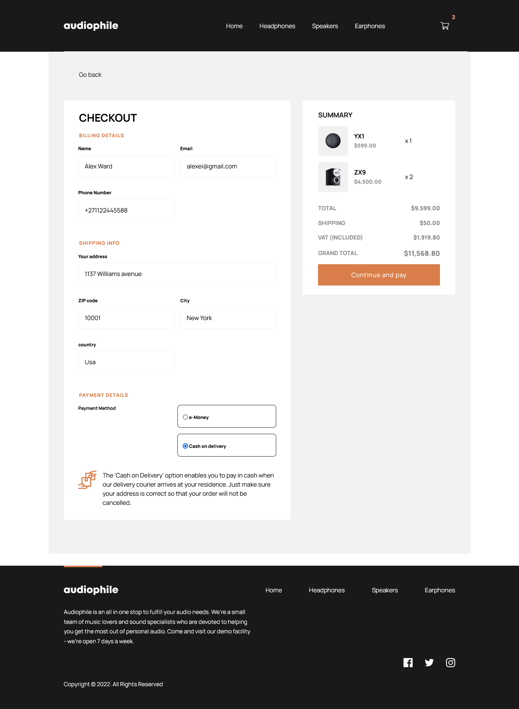

# Frontend Mentor - Audiophile e-commerce website solution

This is a solution to the [Audiophile e-commerce website challenge on Frontend Mentor](https://www.frontendmentor.io/challenges/audiophile-ecommerce-website-C8cuSd_wx). Frontend Mentor challenges help you improve your coding skills by building realistic projects. 

## Table of contents

- [Overview](#overview)
  - [The challenge](#the-challenge)
  - [Screenshot](#screenshot)
  - [Links](#links)
- [My process](#my-process)
  - [Built with](#built-with)
  - [What I learned](#what-i-learned)
  - [Continued development](#continued-development)
  - [Useful resources](#useful-resources)
- [Author](#author)
- [Acknowledgments](#acknowledgments)

## Overview

### The challenge

Users should be able to:

- View the optimal layout for the app depending on their device's screen size
- See hover states for all interactive elements on the page
- Add/Remove products from the cart
- Edit product quantities in the cart
- Fill in all fields in the checkout
- Receive form validations if fields are missed or incorrect during checkout
- See correct checkout totals depending on the products in the cart
  - Shipping always adds $50 to the order
  - VAT is calculated as 20% of the product total, excluding shipping
- See an order confirmation modal after checking out with an order summary

### Screenshot





### Links

- Frontend Mentor URL: [Frontend Mentor](https://your-solution-url.com)
- Live Site URL: [Audiophile ecommerce project](https://audiophile-ecommerce-ckm.netlify.app/)

## My process

### Built with

- Semantic HTML5 markup
- CSS custom properties
- Flexbox
- CSS Grid
- Mobile-first workflow
- [React](https://reactjs.org/) - JS library
- [Sass](https://styled-components.com/) - For styles
- [MongoDb](https://www.mongodb.com/) - database

### What I learned

#### Finding the aspect ratio for a background image

given an image that is to be used as a background image where the height and width of the container is not specified.  The background image will not show up , unless or until the width(which can be specified by `width: 100%` ) and height are given. Setting the height is a bit tricky as using `height: 100% ` does not work. We need to find the aspect ratio for the image to be displayed properly. Read more on here - [Background image - aspect ratio](https://www.smashingmagazine.com/2013/07/simple-responsive-images-with-css-background-images/) Solution:

1. 
```html
<div class="main-container">
    <div class="bg-img-container">
        <div class="inner-container">
            
        </div>
    </div>
</div>
```

2.
 ```css
.bg-img-container {
  background-image: url("../addresshere");
  background-repeat: no-repeat;
  background-position: center center;
  background-size: contain;
}

.inner-container {
     display: block;
     height: 0;
     padding-top: (height-of-img / width-of-height * 100)%;
}
``` 

3. 
```css
/* Hide the fieldset after an invalid fieldset */
fieldset:invalid~fieldset {
    display: none;
}
```

- the fieldset notes above on point 3 where found in the following article:
[Fieldset validation - showing sections in stages](https://developer.mozilla.org/en-US/docs/Web/CSS/:invalid#showing_sections_in_stages)

- React PWA [React Progressive web app](https://www.codica.com/blog/how-to-create-pwa-with-react/)

#### Useeffect 
[A complete guide to useEffect](https://overreacted.io/a-complete-guide-to-useeffect/)

### Continued development

### Useful resources
- [Css filter generator to convert svg to targer color](https://codepen.io/sosuke/pen/Pjoqqp)

## Author

- Website - [Chamu Mutezva](https://github.com/ChamuMutezva)
- Frontend Mentor - [@ChamuMutezva](https://www.frontendmentor.io/profile/ChamuMutezva)
- Twitter - [@ChamuMutezva](https://twitter.com/ChamuMutezva)

## Acknowledgments

This is where you can give a hat tip to anyone who helped you out on this project. Perhaps you worked in a team or got some inspiration from someone else's solution. This is the perfect place to give them some credit.


